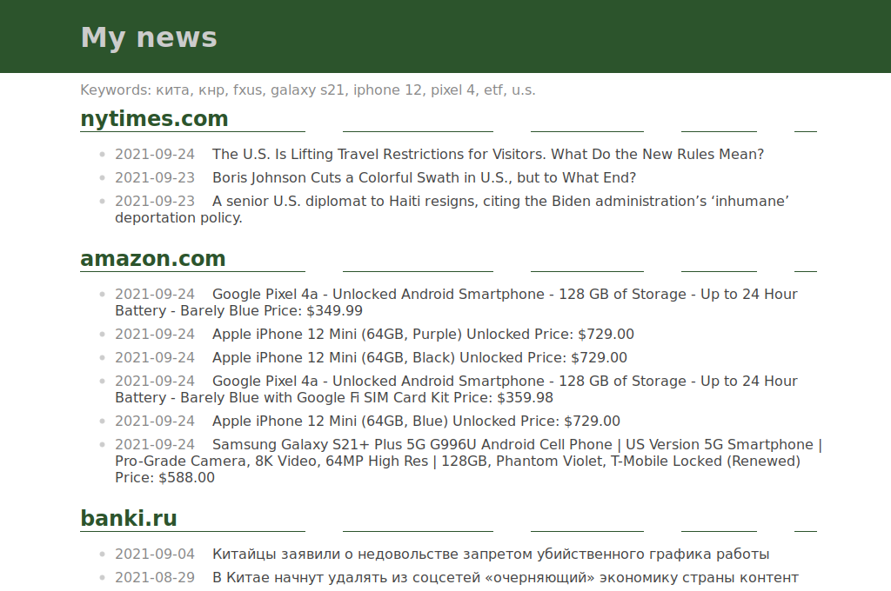

# Web scraper
  
App for requesting data from sites and generate html with filtered data
and links, written in Python.  

## Features
- get list of data from specific site
- search keywords in data
- remove dublicates of data per domain, and dublicates of domains
- generate simple html of data (full or filtered by keywords)
- may be extended by adding new modules with logic for specific sites

## Notes
Search keywords and sites for scraping stored in config.py.
App will try to convert many date formats to date object or return today.
Using simple data format: `["date":date_object, "title":str, "link":str]`
